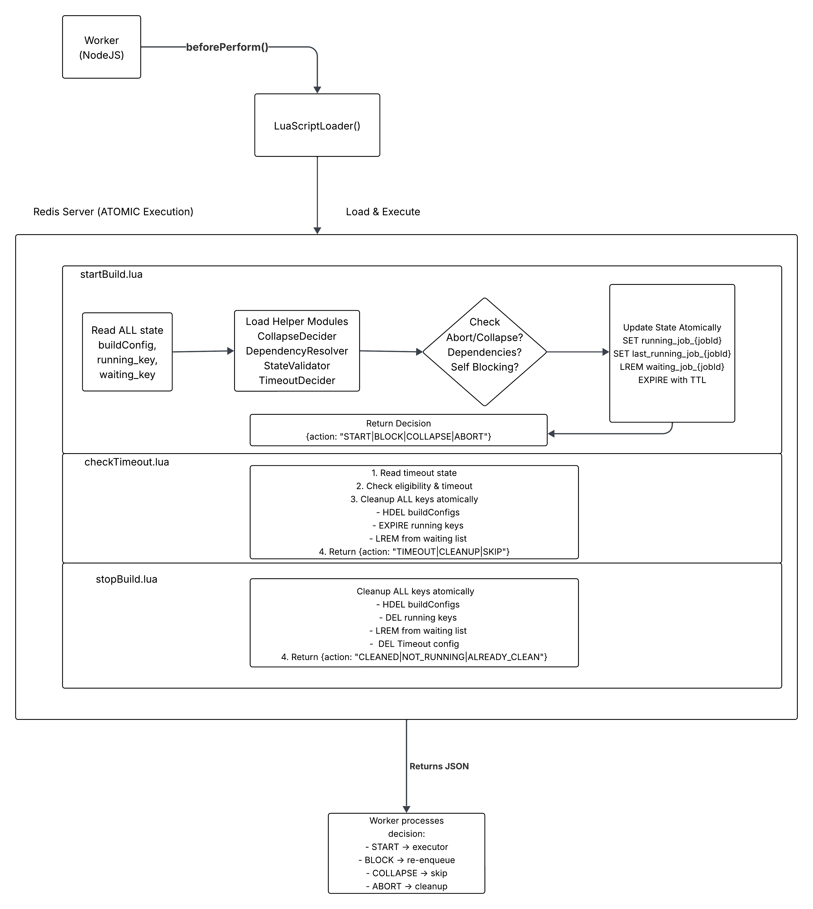

# BlockedBy Architecture Redesign

**Purpose**: Propose a cleaner, more maintainable architecture for the build start/stop Queue system (incl. BlockedBy, Collapse, Timeout)
**Design Proposal:**

---

## Current Architecture - Problems

### 1. **Complexity Analysis**

#### **Current Issues**

**A. State Scattered Across Redis Keys**
```
running_job_{jobId}         # Am I running?
last_running_job_{jobId}    # Who ran last?
waiting_job_{jobId}         # Who's waiting?
deleted_{jobId}_{buildId}   # Am I aborted?
buildConfigs[buildId]       # What's my config?
timeoutConfigs[buildId]     # When do I timeout?
```

**Problem**: No single source of truth. State reconstruction requires 6+ Redis reads.

**B. Implicit State Machine**
```javascript
// State is implicit in Redis key presence/absence
if (runningKey exists) → RUNNING
if (in waitingKey) → BLOCKED
if (deleteKey exists) → ABORTED
if (buildId < lastRunning && collapse) → COLLAPSED
```

**Problem**: State transitions scattered across code. Hard to reason about.

**C. Race Conditions Everywhere**
```javascript
// Non-atomic check-then-act
const value = await redis.get(key);  // Read
if (value) {
    await redis.set(otherKey, ...);  // Write
}
// Another worker can interleave here!
```

**Problem**: Locking added as band-aid. Real issue is non-atomic operations.

**D. Mixed Concerns**
```javascript
async beforePerform() {
    // Concern 1: Filtering (job ownership)
    // Concern 2: Abort checking
    // Concern 3: Collapse logic
    // Concern 4: Blocking logic
    // Concern 5: Queue management
    // Concern 6: Lock management
    // Concern 7: Status updates
    // All in one 300-line function!
}
```

**Problem**: Single Responsibility Principle violated. Hard to test, modify, understand.

**E. Implicit Dependencies**
```
beforePerform → checkBlockingJob
              → blockedBySelf
              → collapseBuilds
              → reEnqueue
              → helper.updateBuildStatus
```

**Problem**: Deep call stack. Side effects hidden. Hard to trace execution flow.

---

## Proposed Architecture - Principles

### **Core Principles**

1. **Single Source of Truth** - One place holds authoritative state
2. **Explicit State Machine** - States and transitions clearly defined
3. **Atomic Operations** - Use Lua scripts or transactions
4. **Separation of Concerns** - Each class has one responsibility
5. **Immutable Events** - Events log what happened, states derive from events
6. **Testability** - Pure functions, dependency injection, clear interfaces

---

## Redesign Proposal

### **State Machine**

#### **Architecture**

```
┌─────────────────────────────────────────────────────────────┐
│                      Build Lifecycle                        │
├─────────────────────────────────────────────────────────────┤
│                                                             │
│  Events (Immutable Log)        States (Derived)             │
│  ────────────────────────      ──────────────────           │
│  BuildEnqueued                 QUEUED                       │
│  BuildBlocked                  BLOCKED                      │
│  BuildUnblocked                READY                        │
│  BuildStarted                  RUNNING                      │
│  BuildCompleted                SUCCESS/FAILURE              │
│  BuildAborted                  ABORTED                      │
│  BuildCollapsed                COLLAPSED                    │
│                                                             │
└─────────────────────────────────────────────────────────────┘
```

#### **Components**

**1. LuaScriptLoader** - Loads and executes Lua scripts on Redis server

**2. startBuild.lua** - Main script handling blocking/collapse/abort logic atomically

**3. checkTimeout.lua** - Timeout detection and cleanup script

**4. stopBuild.lua** - Main script for handling cleanup for stopped build

**5. Helper Modules** (Pure Logic - No Redis calls):
- **CollapseDecider.lua** - Build collapse logic
- **DependencyResolver.lua** - Dependency blocking logic
- **StateValidator.lua** - State transition validation
- **TimeoutDecider.lua** - Timeout calculation logic

### **Future Phase: Introduce Event Log**

**Goal**: Add event sourcing for observability

**Changes**:
```
1. Add Redis Streams for events
   build:events:{buildId} → stream

2. Record all state changes as events
   - BuildEnqueued
   - BuildBlocked
   - BuildStarted
   - BuildCompleted

3. Keep existing state keys (dual-write)
   - Events for debugging
   - Keys for fast reads

4. Build debugging tools (may be)
   - Event replay UI
   - State reconstruction
```

## Trade-offs & Decisions

### **Lua Scripts**

**Pros**:
- Atomic operations
- No locks needed
- Better performance
- Simpler code

**Cons**:
- Lua learning curve
- Harder to debug
- Can't use debugger

**Decision**: YES
- Lua simple (we write once)
- Atomicity > debuggability
- Can test Lua separately
- Worth the complexity reduction

### **Event Sourcing**

**Pros**:
- Full audit trail
- Easy debugging
- Can replay state
- Append-only (fast)

**Cons**:
- More storage
- Event schema versioning
- Eventual consistency?

**Decision**: NO (we can add in a later phase)
- Redis Streams are cheap
- Debugging builds is easier
- Can keep short retention (7 days)

---

### **Architecture Diagram**



KEY BENEFITS:
1 Redis roundtrip (was 6+)
Zero race conditions (atomic execution)
No distributed locks (eliminated Redlock)
Modular design (reusable helper modules)

---

## Success Metrics

- Redis roundtrips: **6+ reduced to 1** (single Lua script execution)
- Lock contention: **Eliminated entirely** (no Redlock)
- Race conditions: **Zero** (Lua atomicity guarantees)

---
